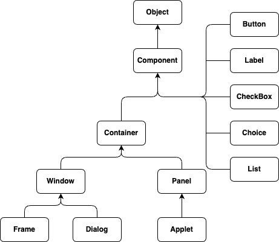

= 01. AWT(Abstract Window Toolkit)

* Java AWT (Abstract Window Toolkit)는 Java *로 GUI(Graphical User Interface) 또는 Windows 기반 응용 프로그램을 개발하기 위한 API* 이다.
* Java AWT 구성 요소는 플랫폼에 따라 다릅니다. 즉 구성 요소는 운영 체제 보기에 따라 표시된다.
* AWT는 무겁다. 즉, 해당 구성 요소는 기본 운영 체제(OS)의 리소스를 사용한다.
* java.awt 패키지는TextField, Label, TextArea, RadioButton, CheckBox, Choice, List등과 같은 AWT API용 클래스를 제공한다.

**Java AWT 계층**

Java AWT 클래스의 계층 구즈는 아래와 같다.

