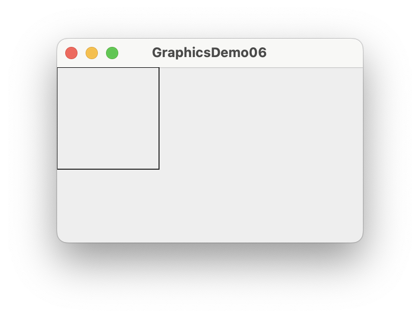

= 02. Swing

**Swing** 은 JFC(Java Foundation Classes) 라이브러리이자 AWT(Abstract Window Toolkit)의 확장이다. Swing은 AWT에 비해 훨씬 향상된 기능, 새로운 구성 요소, 확장된 구성 요소 기능, 끌어서 놓기 지원을 통한 탁월한 이벤트 처리를 제공한다.

* Swing은 API set이다.
* Swing은 GUI(Graphic User Interface)를 설계하기 위해 제공된다.
* Swing은 AWT(Abstract Window Toolkit)의 확장 라이브러리이다.
* GUI의 모양과 기능을 향상시킨 새롭고 향상된 구성 요소 포함되어 이싿.
* Swing은 독립형 Swing GUI 앱을 서블릿 및 애플릿으로 빌드(개발)하는 데 사용할 수 있다.
* model/view  디자인 아키텍처를 사용한다.
* Swing은 AWT보다 휴대가 간편하고 유연하다. The Swing은 AWT 위에 구축되어 있다.
* Swing은 완전히 Java로 작성되었다.
* Java Swing 구성 요소는 플랫폼에 독립적이며, Swing 구성 요소는 가볍다.

**Swing 클래스 계층도**

== 도형 그리기

=== 프레임(Frame) 클래스

프레임은 제목과 테두리가 있는 최상위 창입니다.

다음 코드는 프레임을 만들고, 크기를 지정하는 방법을 보여 준다.

[source,java]
----
import java.awt.*;

public class FrameDemo01 {
    public static void main(String[] args) throws Exception {
      // 1. Frame 만들기
        Frame frame = new Frame("FrameDemo01");
      // 2. Frame의 크기를 지정한다.
        frame.setSize(300, 200);
      // 3. Frame을 보여 준다
        frame.setVisible(true);
    }
}
----

코드에 대한 세부 설명은 다음과 같다.

1. 프레임 만들기는 제목 그대로 Frame의 객체를 생성하여 Frame을 만든다. 하지만, 설정이 완료되지 않았고, 보여주기 옵션이 기본 False로 되어 있어 화면에 출력되지 않는다.
2. 프레임 크기 설정은 생성할 프레임의 크기를 지정한다. 설정되는 크기는 앞서 설명에서와 같이 제목과 제어 버튼이 포함된 영역을 포함한 전체 크기가 된다.
3. 프레임이 생성되고, 크기등의 속성이 지정되어도 화면에는 아무것도 표시되지 않는다. 프레임을 화면에 표시하기 위해서는 setVisible 메소드를 이용해 프레임의 visible 속성을 true로 설정해야 한다. 예전에는 show 메소드를 이용해도 표시가 가능했으나, 현재는 사용하지 말것을 권장하고 있다.

==== 연습 문제

* 기본 프레임을 만들고, 시간에 따라 프레임의 크기가 변화도록 구성하라.

[source,java]
----
import java.awt.*;

public class FrameDemo02 {
    public static void main(String[] args) throws Exception {
        Frame frame = new Frame("FrameDemo02");

        ...

        frame.setSize(...);
        frame.setVisible(true);

        while(true) {
          	...
            Thread.sleep(1000);	// 지정된 시간(ms 단위)동안 멈춰 있다
          	...
        }
    }
}
----

프레임을 만들었으면 해당 프레임에 그림을 그려 보자.

자바에서는 그림을 그리기 위한 도구로 Grahpics 클래스를 지원한다.

=== 그래픽(Graphics) 클래스

Graphics 클래스는 컴포넌트에 그림을 그릴 수있도록 지원하는 모든 그래픽 컨텍스트에 대한 기본 추상 클래스이다.

Graphics 객체는 Java가 지원 하는 기본 렌더링 작업에 필요한 상태 정보를 가지고 있으며, 상태 정보에는 아래의 속성들이 포함된다.

- 그림을 그릴 컴포넌트 객체
- 렌더링 및 클리핑 좌표의 변환 원점
- 현재 클립
- 현재 색상
- 현재 글꼴
- 현재 논리 픽셀 연산 함수(XOR 또는 페인트)
- 현재 XOR 대체 색상

Graphics 클래스는 그림에 관련된 프로그램을 작성하는데 꼭 필요한 클래스로서, 여러 가지 도형을 그릴 수 있는 다양한 메소드들이 제공된다.

==== 그래픽 객체를 이용해 그림 그리기

프레임 클래스는 컴포넌트 클래스의 하위 클래스로서 그래픽 객체를 가지고 있다.

먼저 프레임에서 얻을 수 있는 그래픽 객체를 이용해 사각형을 그려보도록 하자.

[source,java]
----
import java.awt.*;

public class GraphicsDemo01 {
    public static void main(String[] args) throws Exception {
      // 1. Frame 만들기
        Frame frame = new Frame("FrameDemo01");
      // 2. Frame의 크기를 지정한다.
        frame.setSize(300, 200);
      // 3. Frame을 보여 준다
        frame.setVisible(true);
      // 4. Graphics 객체를 가져와 사각형을 그린다
        frame.getGraphics().drawRect(0, 0, 100, 100);
    }
}
----

결과는 아래와 같다.

정확히 원하는 결과는 아니지만, 프레임 객체에 사각형이 그려진 것을 확인할 수 있다.

우리는 결과에서 두가지 궁금한 점을 가질 수 있다.

* 코드에서는 정사각형을 그렸지만, 결과에는 한쪽선이 출력되지 않은 직사각형인가?
* 프레임에서 좌표는 어떻게 되는가?

프레임의 크기는 테두리 표현을 위한 모든 영역을 포함한다.

테두리 영역을 구성하고 부분들에 대한 치수는 getInsets 메소드를 사용하여 얻을 수 있지만, 이러한 치수는 플랫폼에 의존하기 때문에 pack이나 show 메소드 호출을 통해 프레임이 표시할 때까지 유효한 insets 값을 얻을 수 없다.

위의 결과는 테두리 구성 요소들을 감안하지 않고, 프레임 전체를 기준으로 그려 테두리 구성 요소인 타이틀 바에 일부가 가려진 결과를 보여 준다.

이러한, 기본 구성 영역을 피해 그림을 그리기 위해서는 pack이나 show 메소드등을 통해 프레임의 기본 구성이 완료된 후 getInsets를 이용해 해당 영역을 알아내어 계산해야 하며, 실제 표시할 수 있는 영역은 왼쪽 상단 모서리 위치 (insets.left, insets.top)에서 오른쪽 하단 모서리 위치(width - insets.right, height - insets.top + insets.bottom)까지의 사각 영역으로 넓이는 width - (insets.left+insets.right), 높이는 height - (insets.top + insets.bottom)이 된다.

image::./image/java_graphics_insets.png[]

==== 연습문제

프레임의 테두리 영역을 고려하여 정사각형(한변의 길이 : 100)을 유효 공간의 가운데에 위치하도록 하라.

[source,java]
----
public class GraphicsDemo02 {
    public static void main(String[] args) throws Exception {
        int width = 100;
        int height = 100;

        // 1. Frame 만들기
        Frame frame = new Frame("GrahpicsDemo01");
        // 2. Frame의 크기를 지정한다
        frame.setSize(300, 200);
        // 3. Frame을 보여 준다
        frame.setVisible(true);
        // 4. 테두리 영역을 얻어 온다
        ..
      	// 5. 그림을 그릴 수 있는 영역을 계산한다.
        ..
        // 6. 중심을 기존으로 사각형의 위치를 계산한다.
        ..
    }
}
----

결과는 아래와 같다

사각형은 원하는대로 프레임의 테두리나 타이틀 영역을 제외한 나머지 영역의 가운데 위치하였다.

그럼, 여기서 사각형의 시작은 어디일까?

첫번째 사각형 출력 프로그램에서 추측이 가능하지만, 정확하기 알고 가도록 하자.

자바는 아래와 같은 좌표계를 사용하여 원점(0,0)은 왼쪽 상단이다. x좌표는 오른쪽으로 갈수록 증가하며, y좌표는 아래로 갈수록 증가한다. 모든 좌표값은 양수이며 단위는 픽셀(pixel)이다.

==== 연습문제

프레임을 만들고, (10, 10)에서 부터 X축으로 20, Y축으로 20 씩 증가하며 한변의 길이가 5씩 증가하도록 10개의 사각형을 그려라.

단, (10, 10)은 유효 영역 좌표계를 기준으로 하라.

[source,java]
----
import java.awt.*;

public class GraphicsDemo03 {
    public static void main(String[] args) throws Exception {
        // 1. Frame 만들기
        Frame frame = new Frame("GrahpicsDemo03");
        // 2. Frame의 크기를 지정한다
        frame.setSize(300, 300);
        // 3. Frame을 보여 준다
        frame.setVisible(true);
        // 4. 테두리 영역을 얻어 온다
        Insets  insets = frame.getInsets();
        // 5. 유효 영역의 기준점을 계산한다.
				...
        //  6. 중심을 기존으로 사각형의 위치를 계산한다.
        ...

    }
}
----

결과는 아래와 같다.

자바 그래픽에서는 화면 구성을 위한 다양한 구성 요소들을 지원한다. 이러한 구성 요소들은 컴포넌트 클래스의 상속을 받아 정의되며 단독 또는 여러 컴포넌트를 조합하여 하나의 컴포넌트를 구성할 수 있도록 지원(컨테이너 클래스)한다.

=== 컴포넌트(Component) 클래스

자바 AWT에서는 아래와 같은 컴포넌트를 지원한다.

image::./image/awt_component.png[]

앞의 예제에서는 일반적으로 잘 사용하지 않는 프레임에 그림을 그렸다. 프레임에 그림을 그리는 것이 불가능한 것은 아니지만, 프레임은 프로그램의 화면을 구성하기 위한 틀 제공을 목적으로 한다. 그리고, 프레임의 상속 관계를 보면 컨테이너 클래스의 하위 클래스임을 알 수 있다. 이것은 프레임에 다른 컴포넌트 클래스들을 포함 시킬 수 있다는 것을 말한다.

이제 앞서 프레임에 그린 사각형을 것을 컴포넌트를 추가하여 그려 보도록 하자.

컴포넌트 클래스를 살펴 보자. 이름을 통해서 알 수 있는 것도 있고, 비슷하지만 다른 기능을 제공하는 것도 있을 수 있다. 그림을 그리기 가장 알맞은 컴포넌트는 캔버스(Canvas) 클래스이다.

캔버스 클래스는 이름에서 알 수 있듯이 그림을 그리는 하얀 캔버스와 같다. 캔버스 객체에서 얻을 수 있는 그래픽 객체를 이용해 사용자가 원하는 다양한 그림을 그릴 수 있다.

컨테이너에 컴포넌트 추가는 컨테이너 클래스에서 지원하는 add를 통해 가능하다.

[source,java]
----
import java.awt.*;
import java.util.concurrent.CancellationException;

public class GraphicsDemo05 {
    public static void main(String[] args) throws Exception {
        // 1. Frame 만들기
        Frame frame = new Frame("GraphicsDemo05");
        // 2. Frame의 크기를 지정한다
        frame.setSize(300, 200);
        // 3. Canvas를 추가한다
        Canvas canvas = new Canvas();
        frame.add(canvas);
        // 4. Canvas에서 Graphics 객체를 가져와 사각형을 그린다
        canvas.getGraphics().drawRect(0, 0, 100, 100);
        // 5. Frame을 보여 준다
        frame.setVisible(true);

    }
}
----

결과는 아래와 같다.

image::./image/java_graphics_demo05.png["Graphics Demo05"]

의도했던 바와는 달리 아무런 그림도 출력되지 않았다.

왜 그럴가?

이유는 프레임에서 사용된 그래픽 객체와 캔버스에서 사용된 그래픽 객체가 달라져서 캔버스의 그래픽 객체를 통해 그림을 그리지만, 프레임 상에는 표시가 되지 않는다.

그럼, 캔버스를 이용해 그림을 그리려면 어떻게 해야할 것인가?

컨테이너에는 여러 컴포넌트들이 등록 가능하며 컨테이너가 화면을 그려야할 시점이 되면 컨테이너에 포함되어 있는 컴포넌트들에게 자신이 사용중인 그래픽 객체를 넘겨주며 그리기를 수행하도록 한다.

각각의 컴포넌트들은 자신이 가지고 있던 그래픽 객체가 아닌 자신이 컨테이너가 넘겨준 그래픽 객체를 이용해 그림을 그리고 되고, 이를 위해 paint 메소드를 정의하고 있다.

따라서, 사용자가 캔버스를 이용해 그리려면 캔버스 클래스를 직접 사용하지 않고, 캔버스 클래스의 상속을 받은 사용자 정의 클래스를 생성한 후 paint 메소드를 오버라이딩해서 사용해야 한다.

위 설명에 따라 코드를 다시 작성해 보자.

[source,java]
----
import java.awt.*;

public class GraphicsDemo06 {

    public static class MyCanvas extends Canvas {
        @Override
        public void paint(Graphics g) {
            super.paint(g);
            g.drawRect(0, 0, 100, 100);
        }
    }
    public static void main(String[] args) throws Exception {
        // 1. Frame 만들기
        Frame frame = new Frame("GraphicsDemo05");
        // 2. Frame의 크기를 지정한다
        frame.setSize(300, 200);
        // 3. Canvas를 추가한다
        MyCanvas canvas = new MyCanvas();
        frame.add(canvas);
        // 4. Frame을 보여 준다
        frame.setVisible(true);

    }
}
----

결과는 의도한 대로 사각형이 출력된다.

결과는 이전 결과와 비슷하지만 다른 점이 있다. 이부분이 어떻게 달라지게 된 것인지, 어떠한 이점이 있는지 생각해 보자.

==== 연습문제

프레임을 만들고 캔버스를 추가하여 (10, 10)에서 부터 X축으로 20, Y축으로 20 씩 증가하며 한변의 길이가 5씩 증가하도록 10개의 사각형을 그려라.

단, (10, 10)은 유효 영역 좌표계를 기준으로 하라.

[source,java]
----
import java.awt.*;

public class GraphicsDemo06 {

    public static class MyCanvas extends Canvas {
        @Override
        public void paint(Graphics g) {
          ...
        }
    }
    public static void main(String[] args) throws Exception {
        // 1. Frame 만들기
        Frame frame = new Frame("GraphicsDemo05");
        // 2. Frame의 크기를 지정한다
        frame.setSize(300, 200);
        // 3. Canvas를 추가한다
        MyCanvas canvas = new MyCanvas();
        frame.add(canvas);
        // 4. Frame을 보여 준다
        frame.setVisible(true);

    }
}
----

결과는 앞서의 결과와 동일하게 출력되어야 한다.

두 코드에서 가장 큰 차이와 차이가 발생하게된 이유에 대해 생각해 보자.

=== 도형 그리기

Graphics 클래스에서는 선, 사각형, 원, 조각 원(?)등의 몇가지 기본 도형 그리기 지원을 위한 메소드를 지원한다. 각 메소드는 도형을 그리기 위한 요소들을 파라메터로 받게 되며, 도형을 그리기 위한 시작 위치는 도형마다 다를 수 있다.

도형을 그리기 위한 메소드의 일부를 살펴 보자.

**void drawRect(int x, int y, int width, int height)**

drawRect는 사각형 그리기를 지원하는 메소드이다. 여기서 그려지는 사각형은 윤곽선만을 가지게 되며 선의 색은 앞서 설정된 색으로 그려진다.

실제로 사용법은 간단하다.

[source,java]
----
@Override
public void paint(Graphics g) {
  ...
  g.drawRect(10, 10, 100, 50);
  ...
}
----

Component에서 상속된 클래스에서 paint 메소드를 오버라이딩하여 파라메터로 전달되는 Graphics 객체 g를 이용해 그리면 된다. 이와 유사하게 도형 그리기에 사용되는 메소드들은 아래와 같은 종류들이 있다.

[cols="1,4"]
|===
^s| 도형              ^s| 메소드
| 3차원 사각형      | draw3DRect(int x, int y, int width, int height, boolean raised)
| 조각 원           | drawArc(int x, int y, int width, int height, int startAngle, int arcAngle)
| 직선              | drawLine(int x1, int y1, int x2, int y2)
| 타원              | drawOval(int x, int y, int width, int height)
| 다각형            | drawPolygon(int[] xPoints, int[] yPoints, int nPoints)
|                   | drawPolygon(Polygon p)
| 연결된 선         | drawPolyline(int[] xPoints, int[] yPoints, int nPoints)
| 사각형            | drawRect(int x, int y, int width, int height)
| 둥근모서리 사각형 | drawRoundRect(int x, int y, int width, int height, int arcWidth, int arcHeight)
|===

도형은 일반적으로 흔히 알고 있는 이름으로 추가적인 설명은 생략한다.

다각형이나 연결 선을 제외한 대부분의 도형은 넓이와 높이로 이루어진 사각 영역에 도형을 맞추는 형식으로 정의된다.

==== 연습문제 1. 다음의 코드를 완성하라

코드 실행 결과는 아래와 같다.

코드를 완성하라.

[source,java]
----
import java.awt.*;
import javax.swing.*;

public class TestDrawRect {
    public static class MyCanvas extends Canvas {
      ...
    }

    public static void main(String[] args) throws Exception {
        JFrame frame = new JFrame();

        frame.setSize(100, 125);
				...
        frame.setVisible(true);
    }
}
----

==== 연습문제 2. 다음의 코드를 완성하라

코드 실행 결과는 아래와 같다.

코드를 완성하라.

[source,java]
----
import java.awt.*;
import javax.swing.*;

public class TestDrawOval {
    public static class MyCanvas extends Canvas {
      ...
    }

    public static void main(String[] args) throws Exception {
        JFrame frame = new JFrame();

        frame.setSize(140, 125);
				...
        frame.setVisible(true);
    }
}
----

==== 연습문제 3. 다음의 코드를 완성하라

코드 실행 결과는 아래와 같다.

코드를 완성하라.

[source,java]
----
import java.awt.*;
import javax.swing.*;

public class TestDrawPentagon {
    public static class MyCanvas extends Canvas {
      ...
    }

    public static void main(String[] args) throws Exception {
        JFrame frame = new JFrame();

        frame.setSize(140, 125);
				...
        frame.setVisible(true);
    }
}
----

==== 연습문제 4. 다음의 코드를 완성하라

코드 실행 결과는 아래와 같다.

코드를 완성하라.

[source,java]
----
import java.awt.*;
import javax.swing.*;

public class TestDrawStar {
    public static class MyCanvas extends Canvas {
      ...
    }

    public static void main(String[] args) throws Exception {
        JFrame frame = new JFrame();

        frame.setSize(120, 145);
				...
        frame.setVisible(true);
    }
}
----

=== 문자 그리기

Graphics 클래스에서는 문자 출력을 위한 문자 그리기를 지원한다.

=== 이미지 그리기

이미지 그리기는 앞서의 도형 그리기와는 달리 이미지를 특정 위치에 표시하는 것으로 별도의 이미지 객체를 필요로 한다.

=== 도형 채우기

앞에서 그린 도형들은 모두 외곽선만으로 도형을 그리고 있다.

도형을 채우기 위해서는 draw\___ 메소드 대신 fill\___ 메소드를 이용해 그릴 수 있다. 메소드가 형태는 동일하며, draw대신 fill만 변경된다.

**void fillRect(int x, int y, int width, int height)**

실제로 사용법도 drawRect와 동일하다.

[source,java]
----
@Override
public void paint(Graphics g) {
  ...
  g.fillRect(10, 10, 100, 50);
  ...
}
----

도형 채우기도 도형 그리기와 동일한 종류의 메소드를 지원한다.

[cols="1a,4a"]
|===
^s| 도형              ^s| 메소드
| 3차원 사각형      | fill3DRect(int x, int y, int width, int height, boolean raised)
| 조각 원           | fillArc(int x, int y, int width, int height, int startAngle, int arcAngle)
| 타원              | fillOval(int x, int y, int width, int height)
| 다각형            | fillPolygon(int[] xPoints, int[] yPoints, int nPoints)
|                   | fillPolygon(Polygon p)
| 연결된 선         | fillPolyline(int[] xPoints, int[] yPoints, int nPoints)
| 사각형            | fillRect(int x, int y, int width, int height)
| 둥근모서리 사각형 | fillRoundRect(int x, int y, int width, int height, int arcWidth, int arcHeight)
|===

==== 연습문제 5. 다음의 코드를 완성하라

코드 실행 결과는 아래와 같다.

image::./image/java_graphics_fill_star.png["Graphics Fill Star"]

[source,java]
----
import java.awt.*;
import javax.swing.*;

public class TestFillStar {
    public static class MyCanvas extends Canvas {
      ...
    }

    public static void main(String[] args) throws Exception {
        JFrame frame = new JFrame();

        frame.setSize(120, 145);
				...
        frame.setVisible(true);
    }
}
----

=== 도형 출력하기

도형 그리기에서 화면 출력을 위해 수행된 작업은 paint 메소드를 재정의하여  Graphics 객체를 이용한 것이 전부이다.

우리가 만든 코드에서는 paint를 호출하지도 않았고, Graphics 객체는 생성도 하지 않았다.

그럼, paint 메소드는 누가? 언제? 호출되는가.

=== 도형 이동하기

도형의 이동은 화면에 그려진 도형을 하나의 지점에서 다른 지점으로 이동하는 것을 말한다.

=== Exam-1. Recursion을 이용해 다음 그림과 같이 나무 형태를 그려 보자.

1. 임의의 시작점에서 특정 길이만큼 선을 긋는다.
2. 끝나는 지점에서 일정한 각도로 방향을 바꾸고, 선의 길이도 줄인다.
** 방향은 진행방향의 좌우 두갈래로 나뉜다.
3. 길이가 일정 길이 이상일 경우, 1~2과정을 반복한다.

=== Exam-2. Recursion을 이용해 다음과 같이 무한 삼각형을 그려 보자.

1. 임의의 삼각형을 그린다.
2. 삼각형의 각 꼭지점과 꼭지점간 중심점을 연결해 새로운 삼각형을 그린다.
3. 길이가 일정 길이 이상일 경우, 1~2과정을 반복한다.

