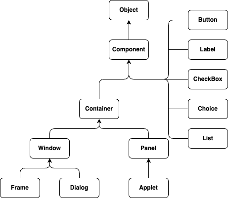
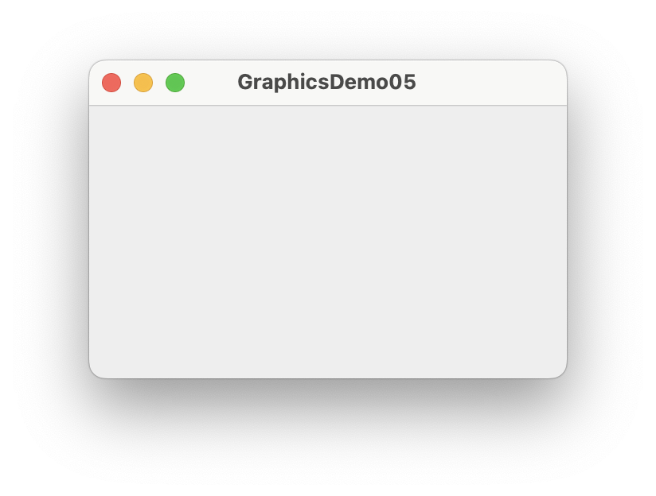
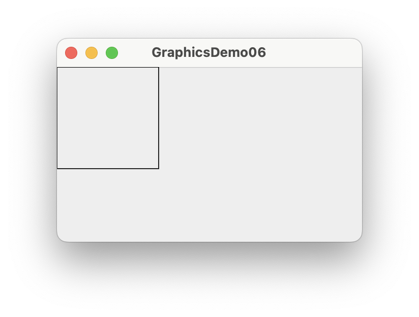
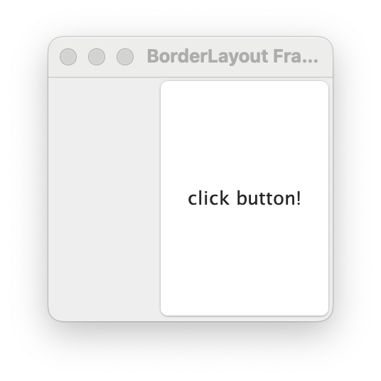
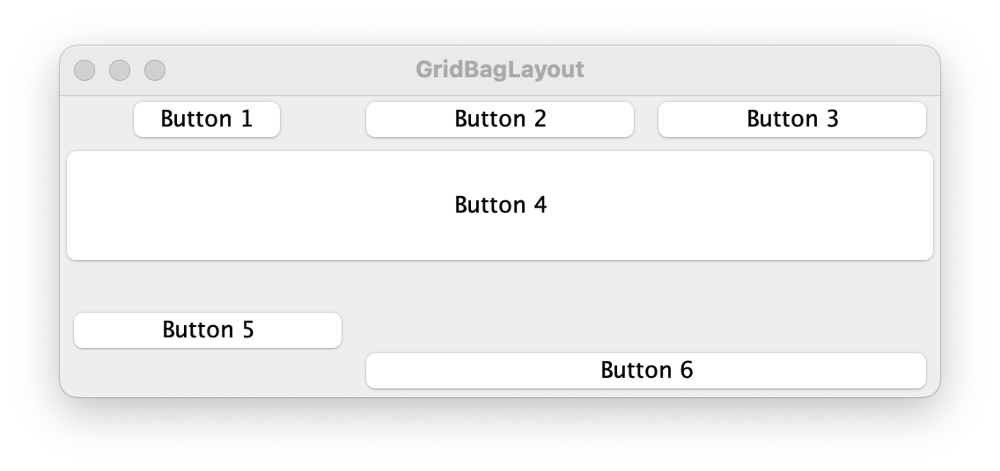
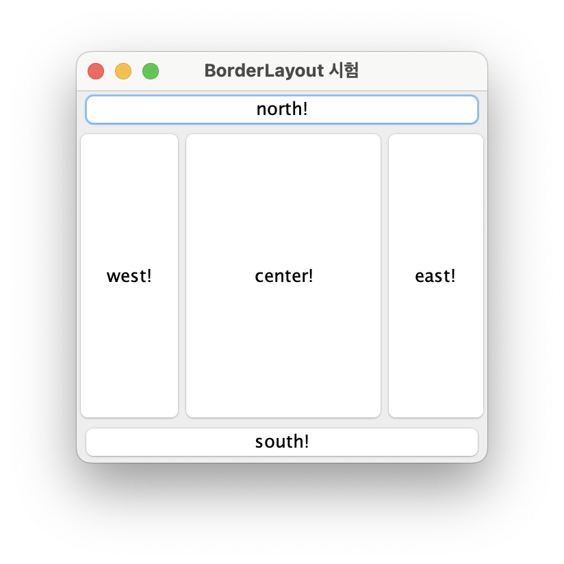
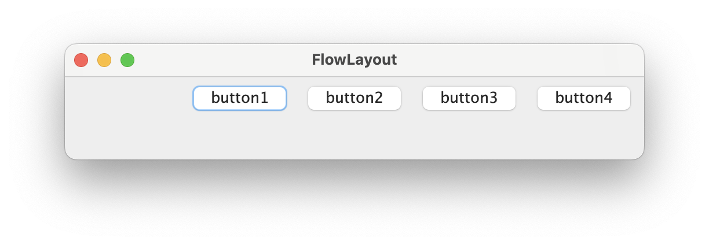
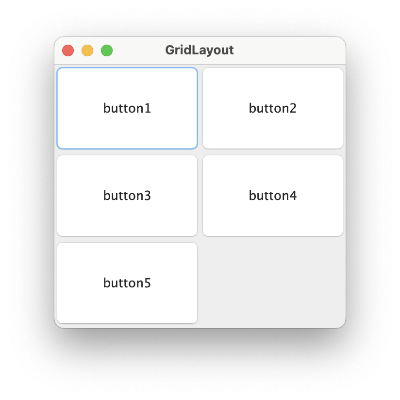
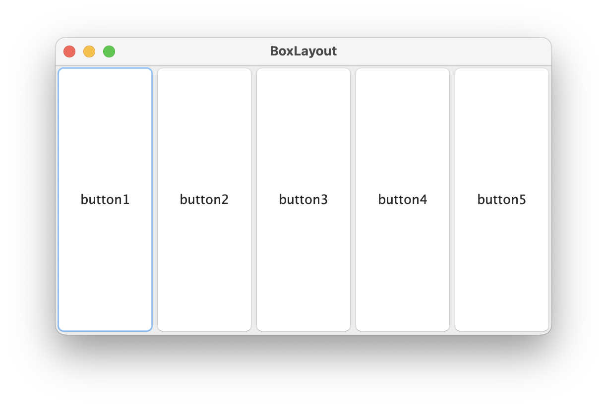

= 3. Component

자바 AWT에서는 아래와 같은 컴포넌트를 지원한다.

앞의 예제에서는 일반적으로 잘 사용하지 않는 프레임에 그림을 그렸다. 프레임에 그림을 그리는 것이 불가능한 것은 아니지만, 프레임은 프로그램의 화면을 구성하기 위한 틀 제공을 목적으로 한다. 그리고, 프레임의 상속 관계를 보면 컨테이너 클래스의 하위 클래스임을 알 수 있다. 이것은 프레임에 다른 컴포넌트 클래스들을 포함 시킬 수 있다는 것을 말한다.

이제 앞서 프레임에 그린 사각형을 것을 컴포넌트를 추가하여 그려 보도록 하자.

컴포넌트 클래스를 살펴 보자. 이름을 통해서 알 수 있는 것도 있고, 비슷하지만 다른 기능을 제공하는 것도 있을 수 있다. 그림을 그리기 가장 알맞은 컴포넌트는 캔버스(Canvas) 클래스이다.

캔버스 클래스는 이름에서 알 수 있듯이 그림을 그리는 하얀 캔버스와 같다. 캔버스 객체에서 얻을 수 있는 그래픽 객체를 이용해 사용자가 원하는 다양한 그림을 그릴 수 있다.

컨테이너에 컴포넌트 추가는 컨테이너 클래스에서 지원하는 add를 통해 가능하다.

[source,java]
----
import java.awt.*;
import java.util.concurrent.CancellationException;

public class GraphicsDemo05 {
    public static void main(String[] args) throws Exception {
        // 1. Frame 만들기
        Frame frame = new Frame("GraphicsDemo05");
        // 2. Frame의 크기를 지정한다
        frame.setSize(300, 200);
        // 3. Canvas를 추가한다
        Canvas canvas = new Canvas();
        frame.add(canvas);
        // 4. Canvas에서 Graphics 객체를 가져와 사각형을 그린다
        canvas.getGraphics().drawRect(0, 0, 100, 100);
        // 5. Frame을 보여 준다
        frame.setVisible(true);

    }
}
----

결과는 아래와 같다.

의도했던 바와는 달리 아무런 그림도 출력되지 않았다.

왜 그럴가?

이유는 프레임에서 사용된 그래픽 객체와 캔버스에서 사용된 그래픽 객체가 달라져서 캔버스의 그래픽 객체를 통해 그림을 그리지만, 프레임 상에는 표시가 되지 않는다.

그럼, 캔버스를 이용해 그림을 그리려면 어떻게 해야할 것인가?

컨테이너에는 여러 컴포넌트들이 등록 가능하며 컨테이너가 화면을 그려야할 시점이 되면 컨테이너에 포함되어 있는 컴포넌트들에게 자신이 사용중인 그래픽 객체를 넘겨주며 그리기를 수행하도록 한다.

각각의 컴포넌트들은 자신이 가지고 있던 그래픽 객체가 아닌 자신이 컨테이너가 넘겨준 그래픽 객체를 이용해 그림을 그리고 되고, 이를 위해 paint 메소드를 정의하고 있다.

따라서, 사용자가 캔버스를 이용해 그리려면 캔버스 클래스를 직접 사용하지 않고, 캔버스 클래스의 상속을 받은 사용자 정의 클래스를 생성한 후 paint 메소드를 오버라이딩해서 사용해야 한다.

위 설명에 따라 코드를 다시 작성해 보자.

[source,java]
----
import java.awt.*;

public class GraphicsDemo06 {

    public static class MyCanvas extends Canvas {
        @Override
        public void paint(Graphics g) {
            super.paint(g);
            g.drawRect(0, 0, 100, 100);
        }
    }
    public static void main(String[] args) throws Exception {
        // 1. Frame 만들기
        Frame frame = new Frame("GraphicsDemo05");
        // 2. Frame의 크기를 지정한다
        frame.setSize(300, 200);
        // 3. Canvas를 추가한다
        MyCanvas canvas = new MyCanvas();
        frame.add(canvas);
        // 4. Frame을 보여 준다
        frame.setVisible(true);

    }
}
----

결과는 의도한 대로 사각형이 출력된다.

결과는 이전 결과와 비슷하지만 다른 점이 있다. 이부분이 어떻게 달라지게 된 것인지, 어떠한 이점이 있는지 생각해 보자.

== 연습문제

프레임을 만들고 캔버스를 추가하여 (10, 10)에서 부터 X축으로 20, Y축으로 20 씩 증가하며 한변의 길이가 5씩 증가하도록 10개의 사각형을 그려라.

단, (10, 10)은 유효 영역 좌표계를 기준으로 하라.

[source,java]
----
import java.awt.*;

public class GraphicsDemo06 {

    public static class MyCanvas extends Canvas {
        @Override
        public void paint(Graphics g) {
          ...
        }
    }
    public static void main(String[] args) throws Exception {
        // 1. Frame 만들기
        Frame frame = new Frame("GraphicsDemo05");
        // 2. Frame의 크기를 지정한다
        frame.setSize(300, 200);
        // 3. Canvas를 추가한다
        MyCanvas canvas = new MyCanvas();
        frame.add(canvas);
        // 4. Frame을 보여 준다
        frame.setVisible(true);

    }
}
----

결과는 앞서의 결과와 동일하게 출력되어야 한다.

image::./images/java_graphics_demo07.png["java_graphics_demo07"]

두 코드에서 가장 큰 차이와 차이가 발생하게된 이유에 대해 생각해 보자.

== Container

컨테이너 클래스는 다양한 컴포넌트를 담아서 하나의 컴포넌트 처럼 관리할 수 있도록 지원하는 클래스 이다.

* TextField, Label 등과 같은 다른 구성 요소를 포함할 수 있는 awt 구성 요소이다
* Frame, Dialog, Panel 클래스가 여기에 속한다.
* 구성 요소를 특정 위치에 배치되는 화면으로써, 구성 요소의 레이아웃을 포함하고 제어한다.

컨테이너의 4가지 유형은 다음과 같다.

* Window
  * 테두리와 메뉴 표시줄이 없다
* Panel
  * 제목 표시줄, 테두리 또는 메뉴 표시줄을 포함하지 않는다.
  * Button, TextField등의 다른 구성 요소들을 배치하기 위한 용도로 사용된다.

* Frame
  * 제목 표시줄, 테두리 또는 메뉴 표시줄을 포함하지 않는다.
  * Button, TextField등의 다른 구성 요소들을 배치하기 위한 용도로 사용된다.

* Dialog

=== Layout

awt에서는 컨테이너안에서 구성 요소들의 위치를 자동으로 지정해주는 다양한 layout을 지원한다.

Layout의 종류는 아래와 같다.

* BorderLayout
* FlowLayout
* GridLayout
* GridBagLayout
* BoxLayout
* CardLayout
* GroupLayout
* SpringLayout

==== BorderLayout

Frame의 기본 layout으로 구성 요소들을 컨테이너의 상/하/좌/우/중앙에 위치 시킨다.

아래의 코드는 버튼을 Frame의 동쪽에 붙이는 코드이다.

[source,java]
----
import java.awt.*;

public class BorderLayoutEx1 {
	/**
	 * @param args
	 * @throws InterruptedException
	 */
	public static void main(String[] args) throws InterruptedException {
		Frame frame = new Frame();

		// 제목 설정
		frame.setTitle("BorderLayout Frame");
		// 크기 설정
		frame.setSize(300, 300);
		// Layout 종류 지정
		frame.setLayout(new BorderLayout());

		Button eastButton = new Button("click button!");
		frame.add(eastButton, BorderLayout.EAST);

		frame.setVisible(true);
	}
}
----

결과는 아래와 같다.

===== FlowLayout

구성 요소들을 왼쪽에서부터 오른쪽으로 일렬 배치하고, 컨테이너의 넓이를 넘어 가는 경우 자동으로 아래에 배치된다.

구성 요소들은 기본적으로 가운데를 기존으로 배치되지만, 컨테이너의 layout설정에서 정렬의 기준을 어디로 할지 설정할 수 있다.

정렬의 기준은 아래와 같다

* FlowLayout.RIGHT : 컨테이너의 오른쪽에 붙여 정렬
* FlowLayout.LEFT : 컨테이너의 왼쪽에 붙여 정렬
* FlowLayout.CENTER : 컨테이너의 가운데를 기준으로 정렬
* FlowLayout.LEADING :
* FlowLayout.TRAILING :

===== GridLayout

컨테이너내부를 행과 열로 구분하고, 구성 요소들을 행과 열을 지정하여 배치한다. 구성요소들의 크기는 자동 조절 된다.

===== GridBagLayout

컨테이너내부를 행과 열로 구분하고, 구성 요소들을 행과 열을 지정하여 배치한다. 구성 요소의 크기 지정이 가능하다.

아래의 Frame에는 다양한 크기의 버튼이 배치되어 있다. 전체적으로는 일정한 규칙을 가지고 있는 것처럼 보이지만, 일부는 그렇지 않은 것처럼 보이는데 이는 GridBagLayout에서 제공하는 속성을 부여함으로 설정 가능하다.

image::./images/java_graphics_gridbag_layout1.png["java_graphics_gridbag_layout1"]

Frame은 가로 4칸, 세로 2칸의 격자 구조를 갖는다.

각 버튼의 속성을 보면 아래와 같다.

* Button 1
  * 위치 : 가로 0, 세로 0
* Button 2
  * 위치  : 가로 1, 세로 0
  * 폭 가중치 : 0.5
* Button 3
  * 위치 : 가로 2, 세로 0
  * 폭 가중치 : 0.5
* Button 4
  * 위치  : 가로 1, 세로 0
  * 폭 가중치 : 0.5
* Button 5
  * 위치 : 가로 1, 세로 1
  * 가로 격자 수 : 2
  * 높이 : 40
  * 폭 가중치 : 0.5

이를 코드로 작성하면 아래와 같다.

[source,java]
----
import java.awt.*;
import javax.swing.*;

public class GridBagLayoutEx1 {
	/**
	 * @param args
	 * @throws InterruptedException
	 */
	public static void main(String[] args) throws InterruptedException {
		JFrame frame = new JFrame();
		GridBagConstraints constraints = new GridBagConstraints();
		constraints.fill = GridBagConstraints.HORIZONTAL;
		// 제목 설정
		frame.setTitle("GridBagLayout");
		//// 크기 설정
		frame.setSize(400, 130);
		//
		frame.setLayout(new GridBagLayout());

		JButton button = new JButton("Button 1");
		constraints.gridx = 0;
		constraints.gridy = 0;
		frame.add(button, constraints);

		button = new JButton("Button 2");
		constraints.weightx = 0.5;
		constraints.gridx = 1;
		constraints.gridy = 0;
		frame.add(button, constraints);

		button = new JButton("Button 3");
		constraints.weightx = 0.5;
		constraints.gridx = 2;
		constraints.gridy = 0;
		frame.add(button, constraints);

		button = new JButton("Button 4");
		constraints.weightx = 0.5;
		constraints.gridx = 3;
		constraints.gridy = 0;
		frame.add(button, constraints);

		button = new JButton("Button 5");
		constraints.weightx = 0.5;
		constraints.gridx = 1;
		constraints.gridwidth = 2;
		constraints.gridy = 1;
		constraints.ipady = 40;
		frame.add(button, constraints);

		frame.setVisible(true);
	}
}
----

==== BoxLayout

행이나 열방향으로 일렬배치한다. FlowLayout과 달리 끝을 만나도 줄바꿈하지 않는다.

**BoxLayout.Y_AXIS**

아래 그림은 BoxLayout을 이용해 Frame에  5개의 버튼을 Y축 기준으로 배치한 것이다.

코드에서 보는 바와 같이 frame의 layout을 BoxLayout으로 설정하고, 버튼을 추가하면된다.

[source,java]
----
import java.awt.*;
import javax.swing.BoxLayout;

public class BoxLayoutEx1 {
	/**
	 * @param args
	 * @throws InterruptedException
	 */
	public static void main(String[] args) throws InterruptedException {
		Frame frame = new Frame();
		// 제목 설정
		frame.setTitle("BoxLayout");
		// 크기 설정
		frame.setSize(300, 300);
		//
		frame.setLayout(new BoxLayout(frame, BoxLayout.Y_AXIS));

		for(int i = 0 ; i < 5 ; i++) {
			frame.add(new Button("button" + (i+1)));
		}

		frame.setVisible(true);
	}
}
----

**BoxLayout.LINE_AXIS**

BoxLayout.X_AXIS와 동일하다.

**BoxLayout.PAGE_AXIS**

BoxLayout.Y_AXIS와 동일하다.

===== CardLayout

여러 컨테이너들이 카드가 쌓여져 있는 것과 같이 충첩해두고, 이중에 하나의 컨테이너를 보여준다.

===== GroupLayout

구성 요소를 그룹화하고 계층적으로 컨테이너에 배치한다. 그룹화는 Group 클래스의 인스턴스에 의해 수행된다.

===== SpringLayout

구성 요소들간 배치 관계를 정의하여, 구성 요소의 배치에 따라 다른 구성 요소들이 상대적 위치에 배치된다.

===== 연습 1. 아래의 설명과 결과를 보고 구성하라.

* 5개의 버튼을 생성한다.
* 실행 결과

**도움말**

* BorderLayout의 static 속성을 참고하라.

**코드 샘플**

[source,java]
----
import java.awt.*;
import javax.swing.*;

public class BorderLayoutEx2 {
	/**
	 * @param args
	 * @throws InterruptedException
	 */
	public static void main(String[] args) throws InterruptedException {
		JFrame frame = new JFrame();

		// 제목 설정
		frame.setTitle("BorderLayout 시험");
		// 크기 설정
		frame.setSize(300, 300);
		//
		frame.setLayout(new BorderLayout());

		JButton eastButton = new JButton("east!");
		frame.add(eastButton, BorderLayout.EAST);
		JButton westButton = new JButton("west!");
		frame.add(westButton, BorderLayout.WEST);
		JButton southButton = new JButton("south!");
		frame.add(southButton, BorderLayout.SOUTH);
		JButton northButton = new JButton("north!");
		frame.add(northButton, BorderLayout.NORTH);
		JButton centerButton = new JButton("center!");
		frame.add(centerButton, BorderLayout.CENTER);

		frame.setVisible(true);
	}
}
----

===== 연습 2. 아래의 설명과 결과를 보고 구성하라.

* 4개의 버튼을 왼쪽에서부터 배치하고, 오른쪽 끝에 붙도록 배치하라
* 실행 결과

**코드 샘플**

[source,java]
----
import java.awt.*;

public class FlowLayoutEx1 {
	/**
	 * @param args
	 * @throws InterruptedException
	 */
	public static void main(String[] args) throws InterruptedException {
		Frame frame = new Frame();

		// 제목 설정
		frame.setTitle("FlowLayout");
		// 크기 설정
		frame.setSize(500, 100);
		//
		frame.setLayout(new FlowLayout(FlowLayout.RIGHT));

		for(int i = 0 ; i < 4 ; i++) {
			Button button = new Button("button" + (i+1));
			frame.add(button);
		}

		frame.setVisible(true);
	}
}
----

===== 연습 3. 아래의 설명과 결과를 보고 구성하라.

* 5개의 버튼을 3행 2열로 배치하라
* 실행 결과

**코드 샘플**

[source,java]
----
import java.awt.*;
import javax.swing.*;

public class GridLayoutEx1 {
	/**
	 * @param args
	 * @throws InterruptedException
	 */
	public static void main(String[] args) throws InterruptedException {
		JFrame frame = new JFrame();

		// 제목 설정
		frame.setTitle("GridLayout");
		// 크기 설정
		frame.setSize(300, 300);
		//
		frame.setLayout(new GridLayout(3, 2));

		for(int i = 0 ; i < 5 ; i++) {
			JButton button = new JButton("button" + (i+1));
			frame.add(button);
		}

		frame.setVisible(true);
	}
}
----

===== 연습 4. 아래의 설명과 실행 결과를 보고 구성하라.

* 6개의 버튼을 3행 3열로 배치하라
* 실행 결과

**코드 샘플**

[source,java]
----
import java.awt.*;
import javax.swing.*;

public class GridBagLayoutEx1 {
	/**
	 * @param args
	 * @throws InterruptedException
	 */
	public static void main(String[] args) throws InterruptedException {
		JFrame frame = new JFrame();
		GridBagConstraints constraints = new GridBagConstraints();
		constraints.fill = GridBagConstraints.HORIZONTAL;
		// 제목 설정
		frame.setTitle("GridBagLayout");
		//// 크기 설정
		frame.setSize(400, 130);
		//
		frame.setLayout(new GridBagLayout());

		JButton button = new JButton("Button 1");
		constraints.gridx = 0;
		constraints.gridy = 0;
		frame.add(button, constraints);

		button = new JButton("Button 2");
		constraints.weightx = 0.5;
		constraints.gridx = 1;
		constraints.gridy = 0;
		frame.add(button, constraints);

		button = new JButton("Button 3");
		constraints.weightx = 0.5;
		constraints.gridx = 2;
		constraints.gridy = 0;
		frame.add(button, constraints);

		button = new JButton("Button 4");
		constraints.weightx = 0.5;
		constraints.gridx = 3;
		constraints.gridy = 0;
		frame.add(button, constraints);

		button = new JButton("Button 5");
		constraints.weightx = 0.5;
		constraints.gridx = 1;
		constraints.gridwidth = 2;
		constraints.gridy = 1;
		constraints.ipady = 40;
		frame.add(button, constraints);

		frame.setVisible(true);
	}
}
----

===== 연습 5. 아래 설명과 결과를 보고 구성하라.

* 버튼 5개를 왼쪽에서 오른쪽으로 정렬한다.

* 버튼의 크기는 창의 크기 따라 변경된다.

* 실행 결과

**코드 샘플**

[source,java]
----
import java.awt.*;
import javax.swing.BoxLayout;

public class BoxLayoutEx1 {
	/**
	 * @param args
	 * @throws InterruptedException
	 */
	public static void main(String[] args) throws InterruptedException {
		Frame frame = new Frame();
		// 제목 설정
		frame.setTitle("BoxLayout");
		// 크기 설정
		frame.setSize(300, 300);
		//
		frame.setLayout(new BoxLayout(frame, BoxLayout.X_AXIS));

		for(int i = 0 ; i < 5 ; i++) {
			frame.add(new Button("button" + (i+1)));
		}

		frame.setVisible(true);
	}
}
----

== Exam-3-1. 퍼즐 만들기

